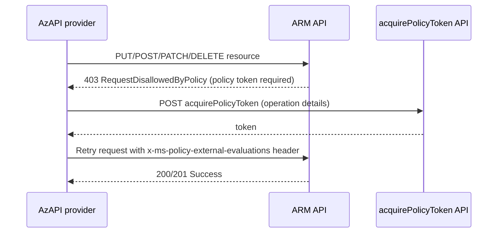

# Feature: Acquire Policy Token

Azure Policy supports *invoke policies* (also known as *external evaluation* policies). When a resource operation is in scope of such a policy, Azure Resource Manager (ARM) calls an external endpoint to evaluate whether the operation should be allowed. To prove that the external evaluation has been performed, ARM expects the request to carry a **policy token**.

When the AzAPI provider sends a write request that is in scope of one of these policies but does not yet carry a policy token, ARM rejects the request with `403 Forbidden` and a `RequestDisallowedByPolicy` error. The AzAPI provider detects this specific denial, **reactively acquires a policy token** on your behalf, and **automatically retries** the original request with the token attached.

This behaviour is built in and requires no configuration. It is intended to make invoke policies transparent to your Terraform workflow, so that resources protected by an invoke policy can be created, updated, and deleted without manual intervention.

## How it works

The provider inspects the responses of HTTP requests. The flow is as follows:

1. The provider sends the original write request (`PUT`, `POST`, `PATCH`, or `DELETE`). `GET` requests are never affected by this feature.
2. If the request succeeds, nothing else happens — the feature is completely transparent.
3. If the request fails with `403 Forbidden`, the provider parses the response and looks for the `RequestDisallowedByPolicy` error code together with a `PolicyViolation` entry that contains `missingPolicyTokenDetails` with `shouldDeny` set to `true`. If those markers are not present, the original error is returned unchanged.
4. When the denial indicates that a policy token is required, the provider calls the `Microsoft.Authorization/acquirePolicyToken` API (`api-version=2025-03-01`) for the request's subscription. The acquire request includes the original operation's URI, HTTP method, and request body so that the external endpoint can evaluate the operation.
5. If a token is returned, the provider rewinds the original request body, attaches the token via the `x-ms-policy-external-evaluations` header, and retries the request.
6. If no usable token is returned, the original policy denial is surfaced unchanged.



## Limitations

- **Change references are not supported.** If the policy denial indicates that a change reference is required (`isChangeReferenceRequired` is `true`), the provider returns an error rather than acquiring a token, because change references are not yet supported by this provider.

## Example

Consider an invoke policy that denies the creation of a storage account unless an external endpoint approves it. With the feature, your configuration does not need any special handling:

```hcl
provider "azapi" {
}

resource "azapi_resource" "storage" {
  type      = "Microsoft.Storage/storageAccounts@2023-05-01"
  name      = "examplestorageacct"
  parent_id = azurerm_resource_group.example.id
  location  = azurerm_resource_group.example.location

  body = {
    kind = "StorageV2"
    sku = {
      name = "Standard_LRS"
    }
    properties = {
      minimumTlsVersion = "TLS1_2"
    }
  }
}
```

When the storage account is in scope of an invoke policy, the provider will:

1. Attempt the create and receive a `403 RequestDisallowedByPolicy` response.
2. Acquire a policy token for the operation.
3. Retry the create with the token attached.

If the external endpoint approves the operation, the resource is created normally. If it denies the operation (no token is issued), Terraform surfaces the original policy error, for example:

```shell
╷
│ Error: creating/updating Resource: ...
│ RESPONSE 403: 403 Forbidden
│ ERROR CODE: RequestDisallowedByPolicy
╵
```

## Troubleshooting

The provider emits `[DEBUG]` log messages describing each step of the token acquisition (detecting the denial, acquiring the token, and retrying the request). To see them, run Terraform with debug logging enabled:

```shell
export TF_LOG=DEBUG
terraform apply
```

Look for log lines that begin with `acquire policy token:` to follow the flow.
