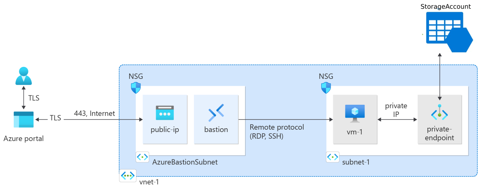

# Use private endpoints for Azure Storage

## Overview



This example shows how to use private endpoints to secure your Azure Storage account. Private endpoints are a secure way to connect to Azure services over a private connection. 

In this example, we will create an Azure Storage account and three private endpoints for the storage account to secure the following services:
- Blob
- Web
- Queue

To verify that the storage account could only be accessed from the virtual network, we will create an Azure Bastion and a virtual machine in the same virtual network. The virtual machine is enabled with a managed identity and granted access to the storage account. And we will use the Azure Bastion to connect to the virtual machine.

We will then try to access the storage account from the local machine and the virtual machine. The access from the local machine should fail, while the access from the virtual machine should succeed.

## Prerequisites

1. You need an Azure account with an active subscription. [Create an account for free.](https://azure.microsoft.com/free/?WT.mc_id=A261C142F)
2. [Install and configure Terraform.](https://learn.microsoft.com/en-us/azure/developer/terraform/quickstart-configure)

## Implement the Terraform code

1. Create a directory in which to test and run the sample Terraform code and make it the current directory.

2. Create a `main.tf` file and copy the content of the [main.tf](./main.tf) file into it.

3. Update the below variables in the `main.tf` file:
    - `resource_name`: The name of the resource group and resources.
    - `location`: The location for the resource group and resources.
    - `subscription_id`: The subscription ID to use.
    - `vm_adminj_user`: The username for the virtual machine.
    - `vm_admin_password`: The password for the virtual machine.

4. Initialize Terraform  
Run `terraform init` to initialize the Terraform deployment. This command downloads the Azure provider required to manage your Azure resources.

5. Login to Azure  
Run `az login` to log in to your Azure account.

6. Create a Terraform execution plan  
Run `terraform plan` to create an execution plan.

6. Apply a Terraform execution plan  
Run `terraform apply` to apply the execution plan to your cloud infrastructure.

## Verify the results

After the Terraform deployment is complete, the storage account can't be accessed from the internet. You can verify this by trying to run the below command from your local machine:

```bash
// the below command should fail
az storage container create --name default --account-name <storage_account_name>
```

To access the storage account, you need to connect to the virtual machine in the same virtual network with Azure Bastion. You can then run the below command to verify that you can access the storage account:

```bash
// login to Azure with managed identity
az login --identity

// the below command should succeed
az storage container create --name default --account-name <storage_account_name>
```
